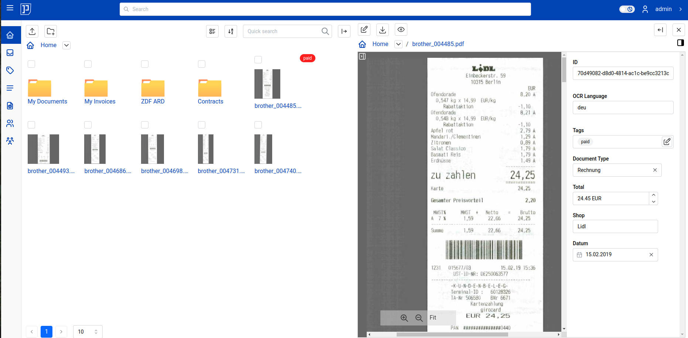

<h1 align="center">Papermerge DMS</h1>

Papermerge DMS or simply Papermerge is a open source document management
system designed to work with scanned documents (also called digital
archives). It extracts text from your scans using OCR, indexes them, and
prepares them for full text search. Papermerge provides look and feel of
modern desktop file browsers. It has features like dual panel document
browser, drag and drop, tags, hierarchical folders and full text search so
that you can efficiently store and organize your documents.

It supports PDF, TIFF, JPEG and PNG document file formats. Papermerge is
perfect tool for long term storage of your documents.

Papermerge's main use case is **long term storage of digital archives**.

This is web-based software. This means there is no executable file (aka no
.exe files), and it must be run on a web server and accessed through a web
browser.

## Repositories

**This is meta-repository** - which means that source code of the
application is not here. **This repository is used to track project's existence,
status and its issues.**

As the application grew it was necessary to split it
into multiple repositories and in same time move new repositories under
[Papermerge Github Organization](https://github.com/papermerge).

| Repository      | Description |
| :---------------|-------------|
| [ciur/papermerge](https://github.com/ciur/papermerge)| Meta-repository which keeps track the project existence, status, and its issues.|
| [papermerge/papermerge-core](https://github.com/papermerge/papermerge-core)| Source code for REST API Backend server. The heart of the project.|
| [papermerge/documentation](https://github.com/papermerge/documentation)| Source code for the documentation.|
| [papermerge/ansible](https://github.com/papermerge/ansible)| Ansible playbook for deployment on remote server/VM|

## Other Resources

| Resource        | Description |
|-----------------|-------------|
|[https://docs.papermerge.io](https://docs.papermerge.io/)| Online Documentation |
|[https://papermerge.com](https://papermerge.com) | Homepage |
|[https://papermerge.blog](https://papermerge.blog) | Blog |
|[YouTube Channel](https://www.youtube.com/channel/UC8KjEsDexEERBw_-VyDbWDg) | YouTube channel |
|[X/Former Twitter](https://twitter.com/papermerge) | X/Former Twitter |
|[Reddit](https://www.reddit.com/r/Papermerge/) | Reddit |

## Features Highlight

* Documents of PDF, JPG, PNG, TIFF formats are supported
* Desktop like user interface
* **OCR** - used to extract text for documents indexing
* Full text search
* Document Versioning (all operations on the documents are non destructive)
* Tags - assign colored tags to documents or folders
* Documents and Folders - users can organize documents in folders
* Multi-User
* REST API

## Donations, Fundraising, Your Support

For donations, you can use PayPal and GitHub Sponsorship:

* [Donate via Paypal](https://www.paypal.com/paypalme/eugenciur)
* [Sponsor via Github](https://github.com/sponsors/ciur)

## Contributing

We welcome contributions! In general, if change is very small, like fixing a
documentation typo, remove unused variable or minor adjustments of docker
related files - you can create a pull request right away. If your change is
small and reasonable it will be (very likely) almost immediately accepted.

For bigger changes, like a new feature or even change/add/remove of
whole paragraph in documentation - please **first discuss the
change** you wish to make via GitHub issue, pull request or [email](mailto:eugen@papermerge.com).

For more information, see the
[contributing](https://github.com/ciur/papermerge/blob/master/CONTRIBUTING.md)
file.
