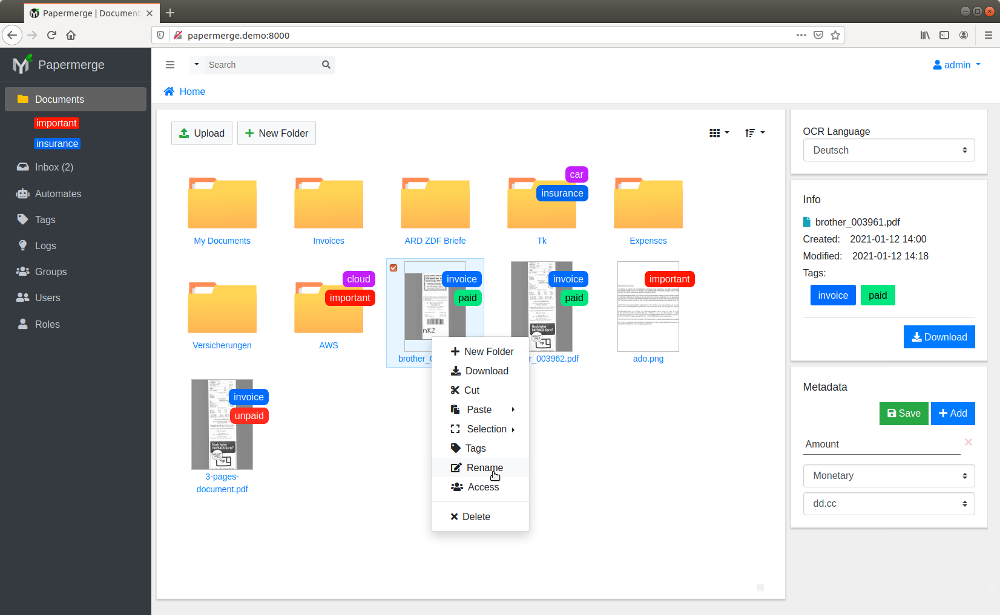
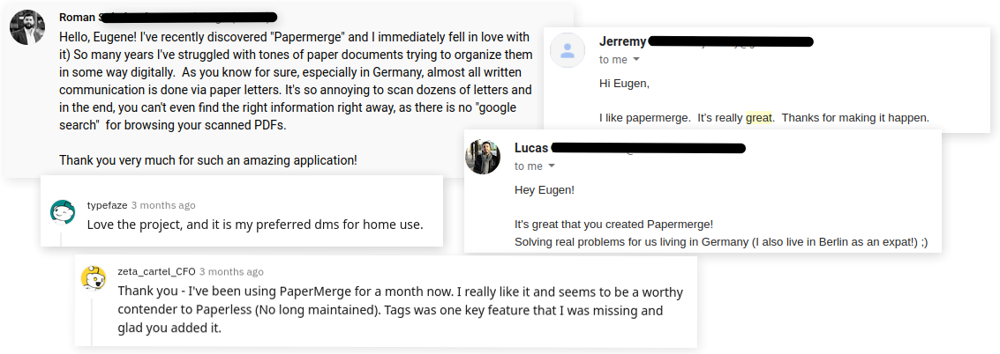
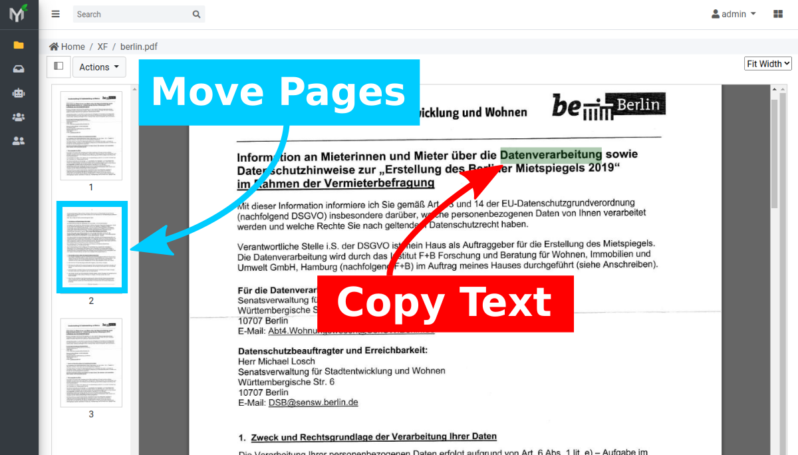
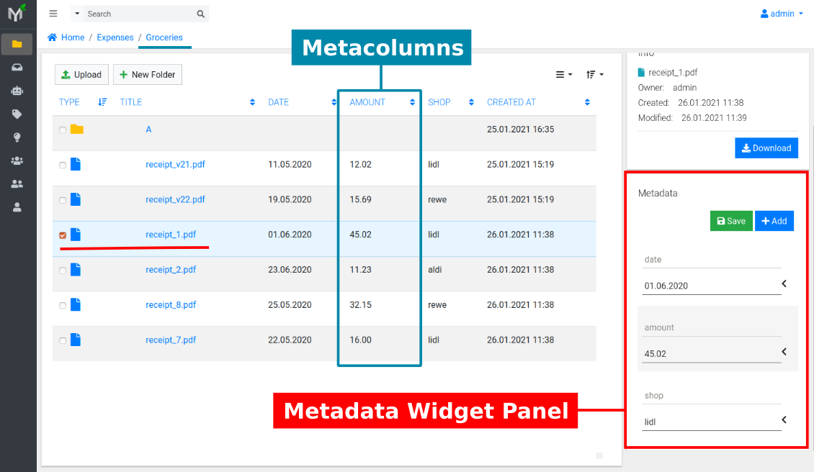

# Papermerge - Document Management System

Papermerge is an open source document management system (DMS) primarily
designed for archiving and retrieving your digital documents. Instead of
having piles of paper documents all over your desk, office or drawers - you
can quickly scan them and configure your scanner to directly upload to
Papermerge DMS.

Papermerge DMS on its turn will
[OCR](https://en.wikipedia.org/wiki/Optical_character_recognition) the
document and index it. You will be able to quickly find any (scanned!)
document using full text search capabilities.

It is built on [Django](https://www.djangoproject.com/).

Papermerge is actively developed.

This is web-based software. This means there is no executable file (aka no
.exe files), and it must be run on a web server and accessed through a web
browser.

## Repositories

This is repository is meta-repository - which means the source code of the
application is not here. **This repository is used to track the existence,
status and its issues.** As the application grew it was necessary to split it
into multiple repositories and in same time move new repositories under
[Papermerge Github Organization](https://github.com/papermerge).

| Repository      | Description |
| :----:          | :---        |
| [ciur/papermerge](https://github.com/ciur/papermerge)| Meta-repository which keeps track of project existence, status, and project issues.|
| [papermerge/papermerge-core](https://github.com/papermerge/papermerge-core)| Source code for REST API Backend server. The heart of the project.|
| [papermerge/papermerge.js](https://github.com/papermerge/papermerge.js)| Source code for Frontend - desktop like modern user interface.|
| [papermerge/documentation](https://github.com/papermerge/documentation)| Source code for the documentation.|
| [papermerge/helm-chart](https://github.com/papermerge/documentation)| Helm Chart for deploying Papermerge in Kubernetes cluster.|

## Other Resources

| Repository      | Description |
| :----:          | :---        |
|[docs.papermerge.io](https://docs.papermerge.io/)| Online Documentation |
|[REST API reference/swagger](https://docs.papermerge.io/swagger-ui/)| Online REST API reference with swagger UI |
|[REST API reference/redoc](https://docs.papermerge.io/redoc/)| Online REST API reference with redoc UI |
|[https://papermerge.com](https://papermerge.com) | Home page |
|[YouTube Channel](https://www.youtube.com/watch?v=xhLUaq46HOw) | YouTube channel |
|[Twitter](https://twitter.com/papermerge) | Twitter |
|[Reddit](https://www.reddit.com/r/Papermerge/) | Reddit |

## Right Tool For You?

To be efficient you always need to choose right tool for the problem. Because
*Document Management* is too generic - I think that a definition of what is a
*Document* in context of this software is needed.

For Papermerge a document is anything which is a good candidate for archiving - some piece of information which is not editable but you need to store it for
future reference. For example receipts are perfect examples - you don't need to
read receipts everyday, but eventually you will need them for your tax
declaration. In this sense - scanned documents, which are usually
in PDF or TIFF format, are perfect match.

Out of scope (at least for near future) are Office documents (ODT, DOCX....),
text files (notes) which usually are editable. In future Papermerge might support Office documents (ODT etc), but that feature will be provided as plugins.

Papermerge is simply not designed to store books. Yes, you can scan a book and import it in Papermege, but again - this is not what Papermerge was designed for.

## Features Highlight

* Documents of pdf, jpg, png, tiff formats are supported
* Desktop like user interface
* Per page OCR of the documents
* Full Text Search of the scanned documents
* Versioning
* User defined metadata per folder/document/page
* Import documents from multiple sources (local disk, email, web upload, REST API upload)
* Tags - assign colored tags to documents or folders ([screencast demo](https://www.youtube.com/watch?v=bshUowL57t8))
* Documents and Folders - users can organize documents in folders
* Multi-User (Groups, Roles)
* User permissions management
* Document permissions management
* REST API ([screencast demo](https://vimeo.com/391436134))
* Page Management - delete, reorder, rotate and extract pages
* Basic automation ([screencast demo](https://www.youtube.com/watch?v=5adbHHmNcEw))

## Testimonials

## Donations, Fundraising, Your Support

:heart: :heart: :heart:

In case you find Papermerge useful, I modestly ask you to support Papermerge via
a small donation. Even an amount as small as $9 will make a huge difference.

For donations, you can use three channels paypal, patreon and github itself:

* [Donate via Paypal](https://www.paypal.com/paypalme/eugenciur)
* [Sponsor via Github](https://github.com/sponsors/ciur)
* [Become a Patreon](https://www.patreon.com/papermerge)

:green_heart: :green_heart:  :green_heart:

## Live Demo

In live demo some of the features are disabled. For example you cannot manage
users, API tokens. Folders/documents with a red lock are read-only for guest user.

* [Live demo](https://demo-app.papermerge.io)
* Username: ``guest``
* Password: ``password77a``

## Contributing

We welcome contributions! In general, if change is very small, like fixing a
documentation typo, remove unused variable or minor adjustments of docker
related files - you can create a pull request right away. If your change is
small and reasonable it will be (very likely) almost immediately accepted. 

For bigger changes, like a new feature or even change/add/remove of
whole paragraph in documentation - please **first discuss the
change** you wish to make via GitHub issue, pull request or [email](mailto:eugen@papermerge.com).

For more information, see the
[contributing](https://github.com/ciur/papermerge/blob/master/CONTRIBUTING.md)
file.

## More Screenshots

### Try it!

You can try it with just 3 simple commands (you need git and docker-compose):

    git clone git@github.com:ciur/papermerge.git
    cd docker/
    docker-compose up

Docker compose command will pull all necessary docker images and start
papermerge on http://localhost:8000. Access it with
default username/password: admin/admin.
