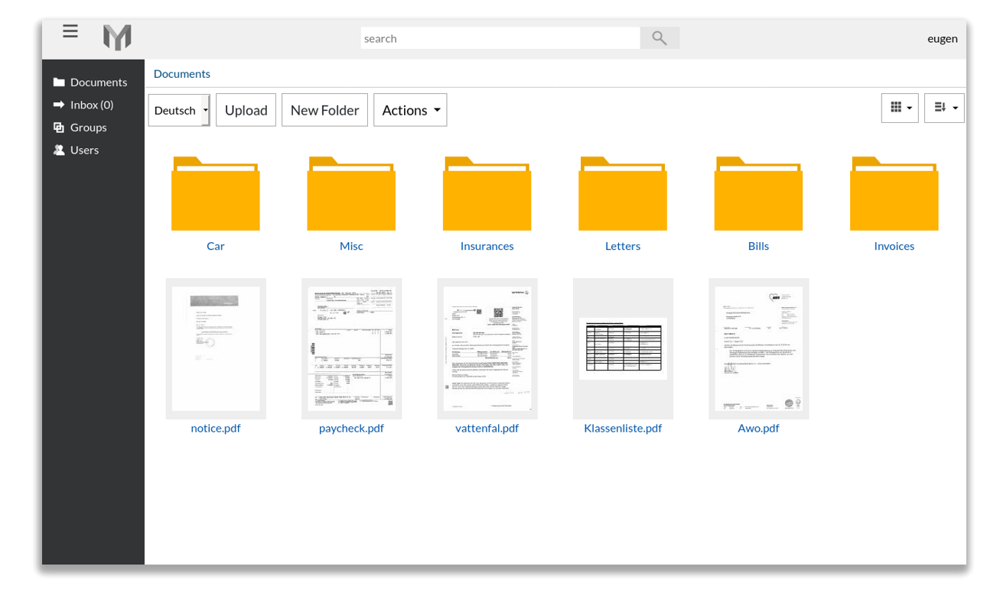
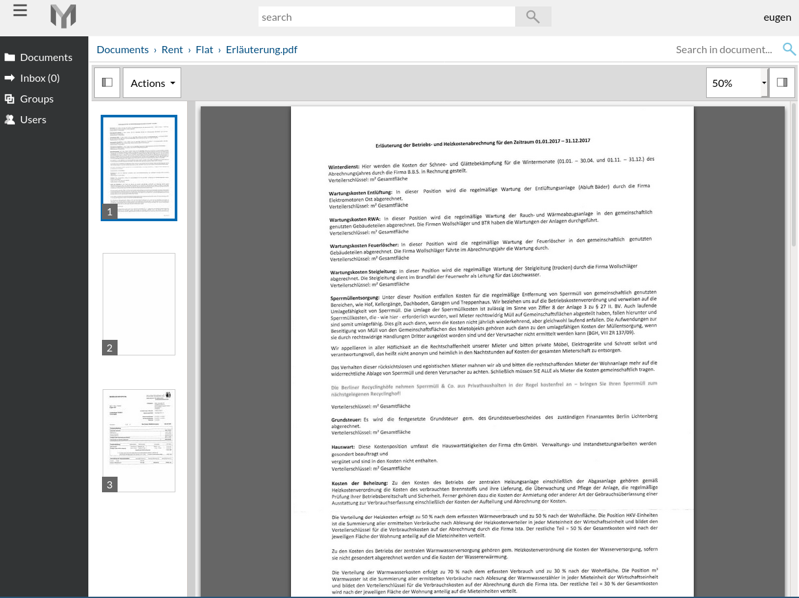

# Papermerge Document Management System

In a nutshell, Papermerge is an open source document management system (DMS) primarily
designed for archiving and retrieving your digital documents. Instead of
having piles of paper documents all over your desk, office or drawers - you
can quickly scan them and configure your scanner to directly upload to
Papermerge DMS.

Papermerge DMS on its turn will
[OCR](https://en.wikipedia.org/wiki/Optical_character_recognition) the
document and index it. You will be able to quickly find any (scanned!)
document using full text search capabilities.

This project is a django application i.e. backend part of the whole papermerge
software. If you want to use it's via web browser i.e. with front-end user
interface you will need to clone [Papermerge
Frontend](https://github.com/ciur/papermerge-js)

## Features
    
* Documents of pdf, jpg, png, tiff formats are supported
* Per page OCR of the documents
* Full Text Search of the scanned documents
* Files and Folders - users can organize documents in folders
* Multi-User
* User permissions management
* Document permissions management 

## Resources

 * [Video Demo](https://www.youtube.com/watch?v=U_x8fOhuMTI)
 * [Documentation](https://papermerge.readthedocs.io/)
 * [English Website](https://papermerge.com)
 * [German Website](https://papermerge.de)

## Screenshots

### Requirements

    Python >= 3.8
    Django >= 3.0
    PostgreSQL >= 11.0
    Tesseract >= 4.1.0

### Start Application in Development Environment

To be able to run it in development you will need:
    
    * python >= 3.8
    * nginx >= 1.16.1 
    * PostgreSQL >= 12.1

Although it is django project - it does not use django's builtin web server.

Create and activate python virtual environment
    
    * python -m venv .venv
    * source ./.venv/bin/activate

Install dependencies:

    * pip install -r requirements.txt

Create config/settings/development.py settings (use development.example.py file as example).
config.settings.development is default DJANGO_SETTINGS_MODULE value.
File config/settings/development.py is listed in .gitignore and thus
is ignored by git.

In config/settings/development.py define following variables:

 * [STATICFILES_DIRS](https://papermerge.readthedocs.io/en/latest/settings.html#staticfiles-dirs)
 * [DATABASES](https://papermerge.readthedocs.io/en/latest/settings.html#databasess)
 * MEDIA_ROOT
 * [STORAGE_ROOT](https://papermerge.readthedocs.io/en/latest/settings.html#storage-root)

STATIC_ROOT is an absolute path to location where papermerge-js assets are. Example from my local environment:
    
        STATIC_ROOT = Path('/home/eugen/ciur/papermerge-js/static/')

where /home/eugen/ciur/papermerge-js is a local clone of [papermerge-js](https://github.com/ciur/papermerge-js)

Run:

    ./manage.py migrate
    ./manage.py createsuperuser
    ./manage.py startetc
    cd ~/.config/systemd/user
    ln -s /papermerge-proj/run/etc/systemd/*  .
    systemctl start --user papermerge

### Contact 

If you have questions, suggestions or feedback, please, [contact me via
email](mailto:eugen@papermerge.com).

