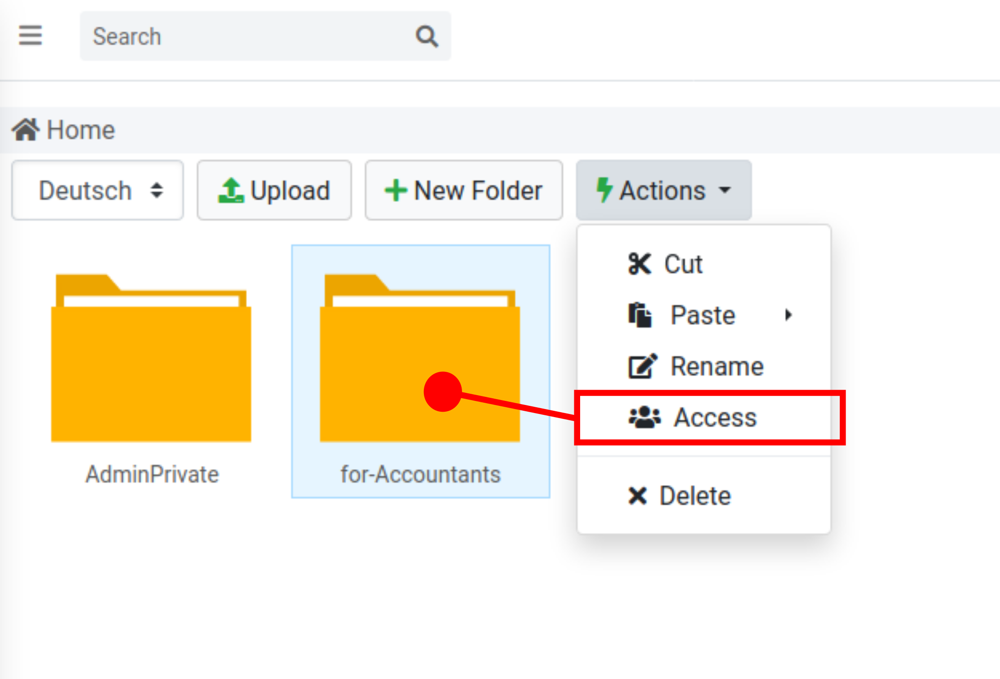
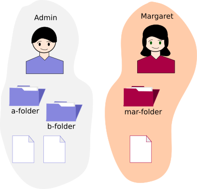
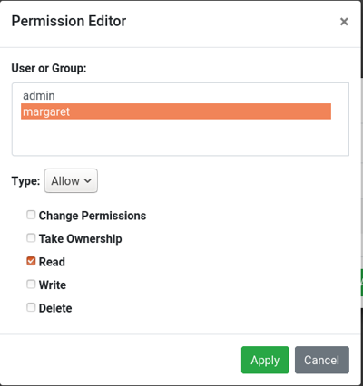
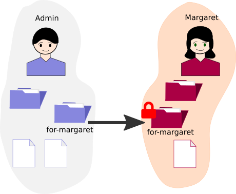

Access and Permissions
=======================

Papermerge features per Folder/per Documents access management.

   Access management for selected folder.

In order to understand important concepts behind access and permissions let's
consider first very simple scenario of two users - admin and margaret (this
are usernames, this is why they are written in lowercase).

Admin - is very first user of the system which automatically makes him superuser.
A superuser is the one who can add other users to the system. So, admin created margaret
user.
In general superuser can do almost anything - add other users, remove other users, access API tokens
and so on. However one very important question arises: *if superuser (admin) can do
everything in the system - does it means that he, the admin, has access to all
folders and documents in the system?*. Answer is - *no*.

.. important::

    Every user (including admin) in Papermerge System has his own space of folders and documents.
    Once a user uploaded a document - he/she is considered the owner of that document.
    Initially **only the owner has full access to the document**. And **only the owner can decide** who will
    have what access and permissions to his/her documents and folders.

Thus, if margaret created a folder titled mar-folder, by default - admin user won't be able to see neither mar- folder nor the content of it.

   Folders created (and documents uploaded) by margaret user, by default are visible accessible
   only by her.

On the other hand, if admin creates a folder titled for-margaret, and adds
read only access permission for margaret (click on folder for-margaret,
access, create, ...):

   Assign read only access for margaret

Then, margaret will be able to see (view, read only mode) folder for-margaret (owned by admin).
Read only documents and folders are marked with big red lock.
This situation is illustrated in figure below.

   Margaret has read only access on folder owned by admin user.

.. note::

   If a document is in read only mode for margaret, then margaret won't be able to change metadata
   associated with the document. Similarly - margaret won't be able to delete or change order of pages
   within respective document.