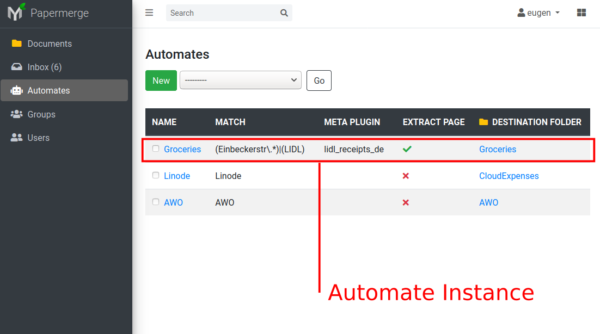
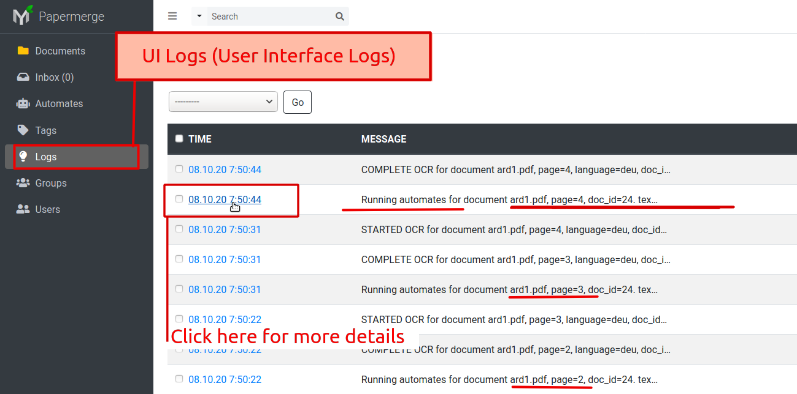
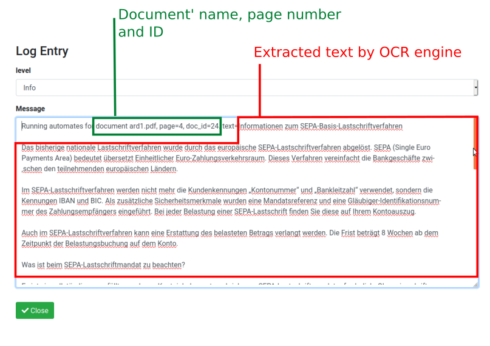
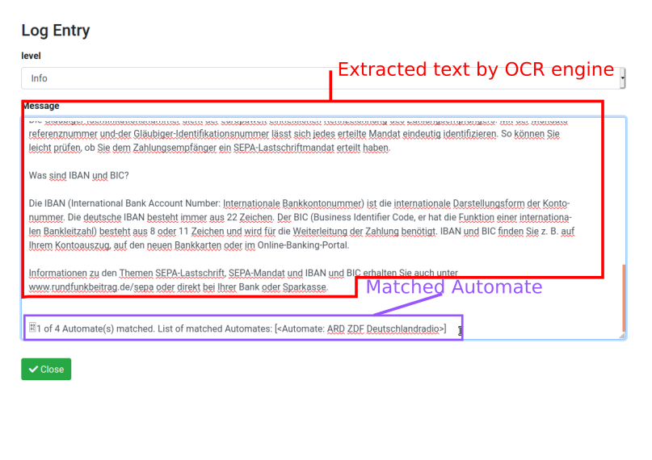

.. _automation:

Automation
============

`Watch here an youtube screencast <https://www.youtube.com/watch?v=5adbHHmNcEw>`_ showing automation feature in action.

With Automation feature you can automate repetitive tasks like:

1. moving documents into their destination folder
2. assigning specific tags to the document

Each automate instance consists of:

* name or a title - give it whatever name you like    
* match - what documents it applies to?
* destination folder - where shall it move the matched document? 
* (optionally) tags - which tags shall it associate to the matched document?

Matching
~~~~~~~~~

In order to decide if automate instance applies to current document - it will look for certain
keywords in the document. For example if document contains capital case REWE, then this document
must be routed to folder Expenses/Groceries; if document contains word Deutschlandradio (german word which translates to english as German radio), then it will be routed to
ARD ZDF Briefe

.. caution::
  
   It is crucial to understand that **matching is per Page**. Thus, statement *match a document* is not entirely correct. 
   Automation processes is triggered every time when :ref:`OCR <ocr>` for
   certain page completes. :ref:`OCRed <ocrs>` page is sent to automation module and
   Papermerge will try to match each automate instance on it. In case there is
   a match - it is considered that document matched automate criteria,
   although technically correct is - page of respective the document matched!

There are 4 different ways to match:

1. Any
2. All
3. Literal
4. Regular Expression

With ``Any`` matching algorithm, document matches **if any of mentioned keyword will match**.
With ``All``, document matches **if all mentioned keywords are found in document**. Keywords order does not matter.
With ``Literal``, match means that the text you enter must appear in the document exactly as you've entered it.
You can use ``Regular Expression`` for matching criteria. Regular expressions is a general programming method of text matching. Computer programmers usually know what it means.  

Inbox + Automates
~~~~~~~~~~~~~~~~~~~

Automates run only for documents in ``Inbox`` folder.

Imported documents from :ref:`local watch directory <importer_directory>` or
:ref:`from email account <importer_imap>` end up in your ``Inbox`` folder.
Papermerge will apply automates only on the documents in ``Inbox`` -
regardless where those documents were imported from. The side effect of this
feature is that **automates will run on documents in** ``Inbox`` **even if you
uploaded them manually** - this one is a very useful trick to test your
automates.

.. note::

    There is a good reason why automates apply only on the documents from
    ``Inbox``. The reason is that in ``Inbox`` documents may disappear. In
    other words -  it is acceptable for documents to suddenly move from
    ``Inbox`` to another folder - due to automation match. 
    If automates would be applied on any folder - then imagine
    how confused you might be if documents would unexpectedly disappear from
    your current folder (due to automation match)!

Automates and UI Logs
~~~~~~~~~~~~~~~~~~~~~~

You can check which automate matched specific document by looking at UI Logs:

In UI Log entry you can see document's name, page number and document id on which
Automates were applied (remember, automates are applied per Page!). 
Also, you can see that text which was extracted from that document:

In order to check which Automate matched this document/page, you need to **scroll to the
very bottom of the message**:

