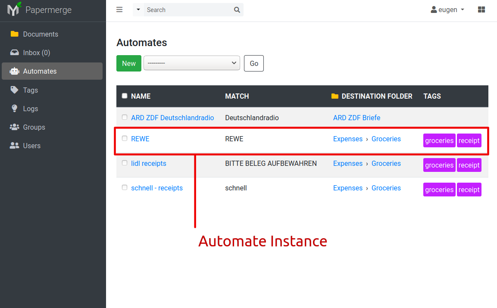

.. _automation:

Automation
============

`Watch here an youtube screencast <https://www.youtube.com/watch?v=5adbHHmNcEw>`_ showing automation feature in action.

With Automation feature you can automate repetitive tasks like:

1. moving documents into their destination folder
2. assigning specific tags to the document

Each automate instance consists of:

* name or a title - give it whatever name you like    
* match - what documents it applies to?
* destination folder - where shall it move the matched document? 
* (optionally) tags - which tags shall it associate to the matched document?

Matching
~~~~~~~~~

In order to decide if automate instance applies to current document - it will look for certain
keywords in the document. For example if document contains capital case REWE, then this document
must be routed to folder Expenses/Groceries; if document contains word Deutschlandradio (german word which translates to english as German radio), then it will be routed to
ARD ZDF Briefe

.. caution::
  
   It is crucial to understand that **matching is per Page**. Thus, statement *match a document* is not entirely correct. 
   Automation processes is triggered every time when :ref:`OCR <ocr>` for
   certain page completes. :ref:`OCRed <ocrs>` page is sent to automation module and
   Papermerge will try to match each automate instance on it. In case there is
   a match - it is considered that document matched automate criteria,
   although technically correct is - page of respective the document matched!

There are 4 different ways to match:

1. Any
2. All
3. Literal
4. Regular Expression

With ``Any`` matching algorithm, document matches **if any of mentioned keyword will match**.
With ``All``, document matches **if all mentioned keywords are found in document**. Keywords order does not matter.
With ``Literal``, match means that the text you enter must appear in the document exactly as you've entered it.
You can use ``Regular Expression`` for matching criteria. Regular expressions is a general programming method of text matching. Computer programmers usually know what it means.  
