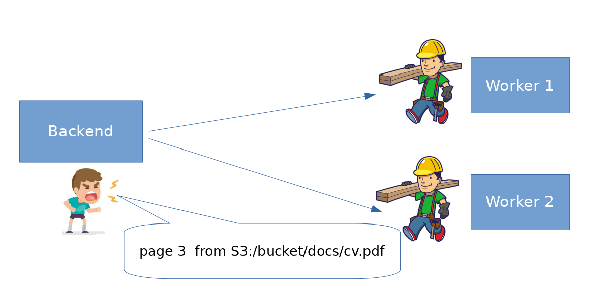

Design
=======

A brief description of the architecture of Papermerge and why such
design decisions were taken. Papermerge project has 2 parts:

    * Web Application
    * Workers

Web application is further devided into Frontend and Backend. As result
there are 3 separate repositories that are part of one whole.

.. figure:: img/design1.png

   High level design. Backend and frontend are separate. 

.. _frontend:

1. Frontend
***********
`Papermerge-js Repository <https://github.com/ciur/papermerge-js>`_

.. warning::
    Name *papermerge-js* is misleading, because it implies that it is only
    javascript is used, which is not true. This project manages all static
    assets: javascript, css, images, fonts.

Modern web applications tend to use a lot of javascript and css. Javascript
code, as opposite to code written in Python, become increasingly difficult to manage.
Same is for css.
To deal with codebase complexity, I decided to split frontend as completely separate 
project. This project is a `Webpack project <https://webpack.js.org/>`_. In practice this
makes it little bit easier to deal with growing javascript code complexity.
The outcome of this project, among others, are two important files:: 
        
        <papermerge-js>/static/js/papermerge.js
        <papermerge-js>/static/css/papermerge.css

There are static files as well, like images and fonts. However images and fonts, are just
placed in ``<papermerge-js>/static`` and nothing really interesting happens with them.

.. _backend:

2. Backend
**********

`Papermerge-proj Repository <https://github.com/ciur/papermerge>`_

Backend is a standard `Django <https://djangoproject.com>`_ application. It uses static files
from frontend part. Throughout documentation it is refered as *backend* because term webapp is more
general (webapp = backend + frontend).

.. _worker:

3. Wrokers
***********
`Papermerge-worker Repository <https://github.com/ciur/papermerge-worker>`_

Workers perform OCR on the documents. Documents are passed as reference (see
note below) from backend via a shared location. In simplest setup  when
everything runs on same machine, shared location is just a folder on local
machie accessible by worker and by backend. In production, shared location is
a S3 bucket.

.. note::

    There are at least two distinct methods of passing documents from backend
    to the workers. First method, which is very simple, but wrong: backend
    will just transfer entire document byte by byte to the worker. Without
    diving deep into technical details, this method is not scalable
    because it deplets backend's memory very quickly.

    Backend instead passes documents by reference - as URL (address). Basically
    it tells workers something like: 
    Hey, guys, please OCR page 1 of document found at ``s3:/bucket/docs/1/user/doc_23.pdf``

   Backend passes documents to workers by reference. 