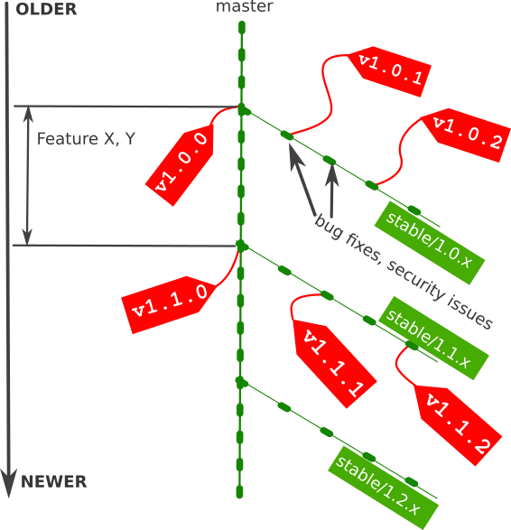

Branching Model
****************

All current development goes into ``master`` branch.

Papermerge versions branch from ``master`` branch and are tagged for specific
version. This is easier to explain with a picture.

   Branching model used by Papermerge project.

* Stable version branches are named ``stable/1.0.x``, ``stable/1.1.x`` etc.
* Git tagging is used to mark specific software version e.g. ``v1.0.0``, ``v1.1.0``, ``v1.2.0`` and so on.

Git Branching/Tagging Blitz Introduction
~~~~~~~~~~~~~~~~~~~~~~~~~~~~~~~~~~~~~~~~~~

To checkout a branch stable/1.1.x, use command::

    $ git checkout stable/1.1.x

To checkout a tagged commit, say a commit tagged v1.1.0, you use same command as checking out a branch::

    $ git checkout v1.1.0
