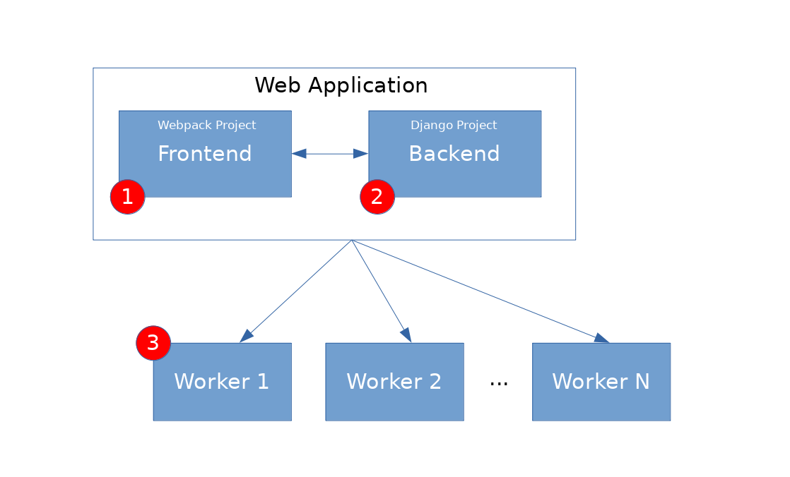

.. _design:

Design
=======

A brief description of the architecture of Papermerge.
Papermerge DMS project has 2 parts:

    * Web Application
    * Worker(s)

Web application is further devided into Frontend and Backend.

   High level design. Backend and frontend are separate. 

.. _frontend:

Frontend
***********
`Papermerge-js Repository <https://github.com/ciur/papermerge-js>`_

.. warning::
    Name *papermerge-js* is misleading, because it implies that it is only
    javascript is used, which is not true. This project manages all static
    assets: javascript, css, images, fonts.

Modern web applications tend to use a lot of javascript and css. Javascript
code, as opposite to code written in Python, become increasingly difficult to manage.
Same is for css.
To deal with codebase complexity, I decided to split frontend as completely separate 
project. This project is a `Webpack project <https://webpack.js.org/>`_. In practice this
makes it little bit easier to deal with growing javascript code complexity.
The outcome of this project, among others, are two important files:: 
        
        <papermerge-js>/static/js/papermerge.js
        <papermerge-js>/static/css/papermerge.css

There are other files as well e.g. images and fonts.
These, so called static assets, which are copied into :ref:`backend`. Outcome of webpack project is
distributed as part of main web application.

.. _backend:

Backend
*********

`Papermerge DMS Repository <https://github.com/ciur/papermerge>`_

Backend is a standard `Django 3.0 <https://djangoproject.com>`_ application. It uses static files
from frontend part. Throughout documentation it is refered as *backend* because term webapp is more
general (webapp = backend + frontend).

.. _workers:

Workers
*********

Workers perform OCR on the documents. There is a built-in worker in main `Papermerge DMS Repository <https://github.com/ciur/papermerge>`_. Built-in worker is called with command::

    $ ./manage.py worker

In :ref:`utilities` part of this documentation you can learn more about built-in :ref:`worker_command`.

In more advanced setups any number of workers can be used (depends on the number of documents you plan to use). However in such cases: 
    
    * a messaging queues like rabbitmq should be configured
    * a shared storage - like S3 - should be configured

These advanced deployements are outside scope of this documentation.