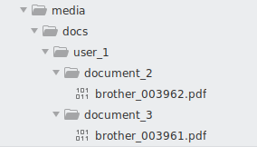
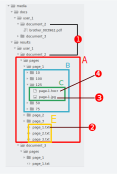

Storage Structure
==================

The primary configuration which determines where uploaded documents are stored
is :ref:`media_dir`. It must be a directory on your local filesystem.

Inside :ref:`media_dir` there two important folders:

    1. docs - stores original (raw, unaltered) documents
    2. results - stores useful information extracted from documents

.. note::

    If you didn't upload any document yet, then :ref:`media_dir` directory
    will be empty (*docs* and *results* will be missing as well). Even more -
    :ref:`media_dir` directory itself might not be created yet.

    Both *docs* and *results* directories are created for when you upload first document.

Original documents are stored under following format:

    * :ref:`media_dir`/docs/user_<id>/document_<id>/<filename>

The picture below illustrates show how :ref:`media_dir` (= media) looks like
after two .pdf documents were uploaded:

.. note::
    For sake of simplicity document version part is not mentioned.
    Document version comes into the picture when user reorders/deletes/cuts
    pages. For each change (e.g. a page is deleted) document version is incremented and corresponding content of results directory in placed in separate
    directory.

Things start to be very interesting when it comes to second directory of
:ref:`media_dir` - *results* directory. As its name suggests, *results*
directory is where processed results are stored. Important information stored
in *results* folder is following:

    1. Document's OCRed text - stored per page (as .txt).
    2. Document's OCRed information stored in hOCR format (as .hocr).
    3. Associated images of each document's page.

Here is an example of how *results* directory look like for upload document
with id=2 corresponding to user with id=1:

1. *docs* and *results* directories' document_2 contain information for same document (with id=2)
2. Extracted plain text from documents - for each page.
3. Image of the first page for 125% zoom.
4. `hOCR <http://kba.cloud/hocr-spec/1.2/>`_ file of the first page for 125% zoom (matches file from 3.)

Notice that point 1 in illustration above shows (arrow marked with red circle
with number 1 on it) document_2 directory from *results* corresponds to
document_2 directory from *docs*.

As you can see in red square (red A) - Papermerge works on page level i.e. it
extract information for each page separately. In yellow square (marked with
yellow letter E) you see that Papermege extracted text information and stores
it in .txt files for each page. Thus, document in picture above, has 3 pages.
Text from page_<xyz>.txt files will be copied into database and then later
indexed. This allows users to perform searches per document's page.

Next interesting area - is area B (blue square). There, Papermerge stores
information per each page for specific zoom step.

Area B contains information for specific page for each of those zoom level
(zoom step) user can perform in UI. There are two files for each zoom step -
one jpeg and one `hocr <http://kba.cloud/hocr-spec/1.2/>`_ file (area C -
green square). The hocr file uses xml format to describe text coordinates.
Hocr files are used to map text over image and enable users to select text.

    .. note::

        Copying text from a scanned document is an extremely useful feature!
        Copying text feature relies entirely on hocr files.
        

Both ``Document`` and ``Page`` models are defined in ``papermerge.core.models`` module. Both ``Document`` and ``Page`` have a python property called path::

    document = Document(...)
    document.path  #  <- instance of DocumentPath
    Page = Page(...)
    page.path   #  <- instance of PagePath

``DocumentPath`` and ``PagePath`` are defined in mglib.path module and they are responsible for managing paths like:

  <user_id>/<doc_dir>/<version>/<file_name>

A good place to start learning about ``DocumentPath`` and ``PagePath`` is corresponding ``test_path.py`` file in mglib's test directory.