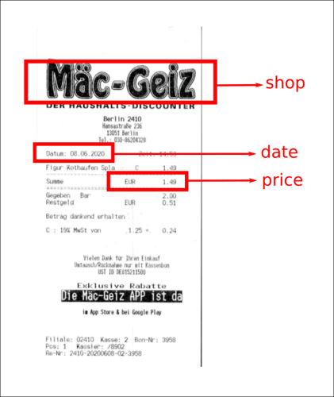
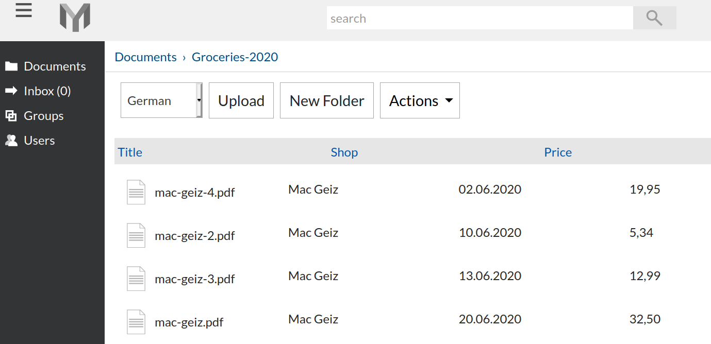

Metadata
============

Main Concepts
~~~~~~~~~~~~~~

Metadata is extra information about your documents. In other words - data about your data.
Following picture is a (scanned document) receipt with highlighted shop name, price and date on it.

   Receipt with metadata

This additional information - shop name, price and date is so called document's **metadata**.
Metadata is extremely useful when you need to *locate specific document among many other very similar documents*.

Imagine that you scanned 60 groceries receipts and *organized* them in a
folder named Groceries. If you would just store those receipts on an ordinary
file system, then only way to distinguish between files is by file names or
maybe by their text content (if your storage supports OCR) - finding, specific
file, say all receipts you got in June 2020, would be time consuming.

A more efficient and practical way to tackle this problem is by associating to
all scanned documents (receipts in this example) - metadata. Let's continue
with groceries receipts example. It would be very time consuming to go to each
document and add metadata to each file individually. A faster way to create metadata and
associated it to a group of files, is by a creating a folder - add metadata to
that folder - let's name it Groceries-2020 - and then just copy all groceries
related files into that folder.

.. figure:: img/metadata/02-inherited-metadata.png

   Metadata is inherited from folder to all documents within it

.. note::

    Newly uploaded to Groceries-2020 documents (or moved from different folder) will automatically inherit metadata labels defined on that folder.

Now all receipts in Groceries-2020 folder can be displayed as lists with price, date and shop information. Isn't now easier to understand when and how much you spent in each case?

   With metadata information associated it is easier to navigate receipt documents

Labels, Values and Types
~~~~~~~~~~~~~~~~~~~~~~~~~

Metadata **label** is the *repetitive* or *common*  information you are interested
about. In groceries example shop, date and price are labels. Other metadata
labels examples would be a Tax-ID from tax declaration documents, Client-ID from
invoice documents and License-ID from pool of licenses you are managing.

 .. note::

    Internally metadata labels are called - keys.

Metadata **value** is, well, the value of specific label. Continuing with
groceries examples the "10,99", "3,69", "29,00" are all metadata values for
labels which we named - "price". Groceries-2020 folder has only 3 labels, but can
have any number of values.

Metadata can be of specific **type**. Metadata can express monetary
information (e.g. a price), a date or it can be some sort of ID (a number and
eventually with letter characters). 

Knowing metadata type is not enough. Consider example of 06.05.2020 date. 
Does 06.05.2020 date refer to 6th of May 2020 or does it refer to 5th of June
2020 ? To remove any confusion, when you define a new metadata, usually you
will need to provide a specific **format** for that type. In previous example
if format would be dd.mm.yyyy then  mentioned date would refer to 6th of June
2020.