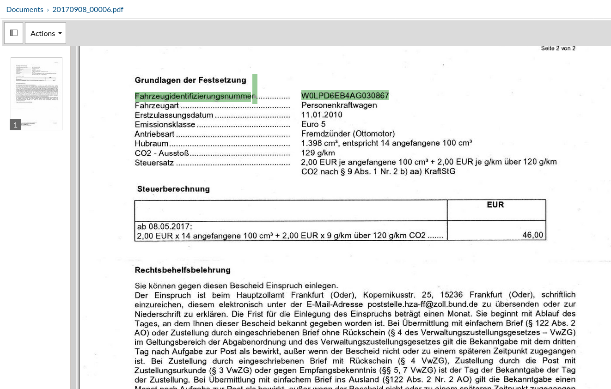
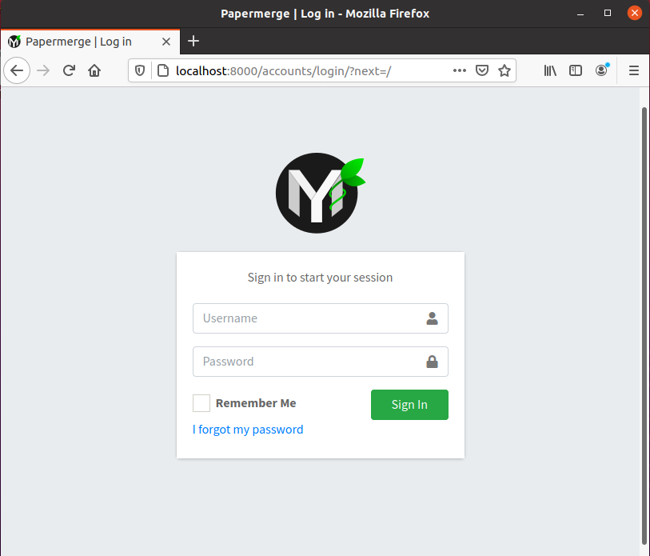

Manual Way
************

If you follow this document and still have troubles, please open an
`issue on GitHub: <https://github.com/ciur/papermerge/issues>`_ so I can fill in
the gaps.

This guide is split into two parts: short one and very detailed one. 
:ref:`manual_way_short_version` is meant for people who are confortable with development tools
like Python, Django, pip, git or even gcc. In this case I will skip most of details
as they will sound boring for such persons.

:ref:`manual_way_detailed_version` is for people who probably heard of Python - as programming
language - but do not have any experience working with it. Any form of prior
programming (in ruby, perl, java, C/C++) experience will help you to grasp the
concepts quicker.

In both versions of this guide you need to know what is a command line
terminal and how to work with it. In general Papermerge is a Linux/Unix based
software. In this guide I will use Ubuntu 20.04 as example, but this
instructions can be adopted easily for any Linux distribution.

.. _manual_way_short_version:

Short Version
~~~~~~~~~~~~~~~

First :ref:`download` the sorce code.

1. Within extracted directory copy ``papermerge.conf.py.example`` to ``/etc/``::

    $ cp papermerge.conf.py.example /etc/papermerge.conf.py
    $ chmod 640 /etc/papermerge.conf.py
    
1a. Look at the config-file with your favorite text editor. Leave default settings or adjust to your needs:
    
    * ``DBDIR``: SQLite database storage location
    * ``MEDIA_DIR``: your documents storage location
    * ``STATIC_DIR``: this is where all static files will be collected by ``collectstatic`` command
    * ``IMPORTER_DIR``: Papermerge is looking for new files here

2. Create and Activate python virtual environment with::

    $ python3 -m venv .venv
    $ source .venv/bin/activate

3. Install necessary dependencies::

    $ pip install -r requirements/base.txt

4. Initialize SQLite database with::

    $ ./manage.py migrate

5. Collect static files for webserver with::

    $ ./manage.py collectstatic

6. Create a user for Papermerge instance::

    $ ./manage.py createsuperuser

7. Start webserver with::

    $ ./manage.py runserver <IP>:<PORT>

If no specific IP or PORT is given, the default is 127.0.0.1:8000 also known as http://localhost:8000/. 
It should look like in the screenshot below. Use the login credentials that you created in #6 to access Papermerge.

    .. figure:: ../img/login.png

You are almost there, but there is no worker running yet.

8. In a separate window, change to the project's root directory again, but this time, you should start the worker script with ./manage.py worker.

9. Now put a JPEG, PNG or TIFF file into the IMPORTER_DIR.
10. Wait a few minutes for Papermerge to run OCR.
   Preview of the documents uploaded:

    .. figure:: ../img/uploaded_docs.png

11. Now you should be able to select text in OCRed document!

   Now you should be able to select text

.. _manual_way_detailed_version:

Detailed Version
~~~~~~~~~~~~~~~~~~

Step 1 - Python and Friends
#############################

Papermerge is written in Python. First thing you need to make sure python interpreter is installed.
Ubuntu 20.04 comes with python interpreter already installed. 
However, the command to invoke python interpreter is ``python3``::

    $ python3 --version
    Python 3.8.2

.. note::
    
    Python community now transitions from python2 (which is not maintained
    anymore) to python3. This is why in many Linux distributions you can
    access python interpreter either with ``python`` command or with
    ``python3`` command. 

.. important::
        Make sure your python is at least version 3.7

A close python's friend is `pip <https://pip.pypa.io/en/stable/>`_ command. `pip <https://pip.pypa.io/en/stable/>`_ is python's package manager.
Similar as with python interpreter story - there might be either pip or ``pip3`` - later is specifically for
python version 3. We will use pip3::

    $ sudo apt install python3-pip

Make sure it was installed::

    $ pip3 --version
    pip 20.0.2 from /usr/lib/python3/dist-packages/pip (python 3.8)

Another package which you need to install is ``python3-venv``. This one will be
used in Step 2  we'll learn and setup python virtual environment::

    $ sudo apt install python3-venv

Although Papermerge is written in python, it uses some *special*
python modules which are compiled from C sources and used in binary form. This
means that you need `gcc compiler <https://gcc.gnu.org/>`_ installed as well.

In Ubuntu 20.04, ``gcc`` is available via ``built-essential`` package::

    sudo apt install build-essential

Double check that ``gcc`` was installed::

    $ gcc --version
    gcc (Ubuntu 9.3.0-10ubuntu2) 9.3.0
    Copyright (C) 2019 Free Software Foundation, Inc.
    This is free software; see the source for copying conditions.  There is NO
    warranty; not even for MERCHANTABILITY or FITNESS FOR A PARTICULAR PURPOSE.

Ok, great! We have to install one more utility - ``git``. Strictly speaking,
you don't need ``git``, because you can :ref:`download` the tarball and unzip
(or untar or extract) sources. But let's stick with git::

    $ sudo apt install git

Double check that ``git`` was installed::

    $ git --version
    git version 2.25.1

And now clone the latest stable version of Papermerge directly from GitHub repository::

    $ git clone --branch v1.4.0 https://github.com/ciur/papermerge.git  PapermergeDMS

.. note::

    As of writing this - latest stable version of Papermerge is 1.4.0, thus the argument ``--branch``
    with respective version. Also, notice that repository was cloned inside folder named PapermergeDMS, you
    can choose whatever title for that folder suites you.

From now on, I will refer to PapermergeDMS folder as *project root* or *top
level folder of the project*

Step 2 - Python Virtual Environment
####################################

Change directory to project's root (folder where you cloned/extracted sources)::

    $ cd PapermergeDMS

Our goal in this step is to install python dependencies - like `Django
<https://www.djangoproject.com/>`_ for example. Most important dependencies -
without which project won't start - are listed in ``requirements/base.txt``
(relative to project's root).

The command to do that is as simple as ``pip install -r
requirements/base.txt`` - but please don't rush to type it yet. We need to
clarify the concept of python virtual environment first.

If you simply type ``pip insall -r requirements/base.txt`` - it will install
packages **system-wide**. A better approach is to install dependencies **per
project**. So, *the place* designated for python packages specific for this
project is called a *virtual environment*. Let's create a python virtual
environment and name it ``.venv``::

$ python3 -m venv .venv --system-site-packages

.. note::

    For virtual environment you can choose whatever name you want. For example
    you can choose to name your virtual environment py37, in that case command
    will be ``python3 -m venv py37``. However, I chose *.venv* because in
    Unix/Linux dotted folders have special meaning - they are hidden so to
    speak.

.. note::

    ``--system-site-packages`` is necessary, it will install a package called ``wheel``.
    Without ``wheel`` package, pip install later will issue warning.

Next we need to *activate* virtual environment::

$ source .venv/bin/activate

Terminal's prompt (bash - in Ubuntu) will change to indicate that python virtual environment is active.

.. figure:: ../img/setup/01-active-venv.png

.. note::

    Python virtual environment is just a directory where python packages will
    be installed. Activating python environment is basically changing your
    current ``PATH`` variable - this is exactly what ``source
    .venv/bin/activate`` command does. If you will run ``echo $PATH`` you will
    notice that ``PapermergeDMS/.venv/bin`` is first in path, this means that
    python interpreter first of all will look up for its dependencies there.

And now, with python virtual environment active, let's install Papermerge dependencies::

    $ source .venv/bin/activate # a reminder to run this first
    $ pip3 install -r requirements/base.txt

At this point, all python packages were installed inside directory
``.venv/lib/python3.8/site-packages`` and that directory is first one in your
path.

Step 3 - Manage Command
#########################

Papermerge is based on `Django Web Framework <https://www.djangoproject.com/>`_.
Django provides a ``manage.py`` script which is used to run all project related commands.
``manage.py`` script is located in project's root directory.

First let's run migrations::

    $ ./manage.py migrate

*run migrations* - in django's jargon means that you prepare the database. By
default Papermerge (as any Django based project) uses `sqlite
<https://sqlite.org/>`_ database - which is stored in a single file.
``./manage.py migrate`` command will create that file (it is called db.sqlite3
and is in project's root directory) and create database schema for the
project.

We are not ready yet, but at this point, you can built-in web server and
access login screen::

    $ ./manage.py runserver

``runserver`` command will start web server on port ``8000``. You
can access login screen via any web browser by pointing it to
``http://localhost:8000/``

