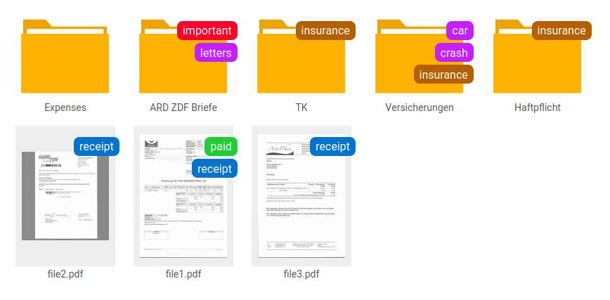
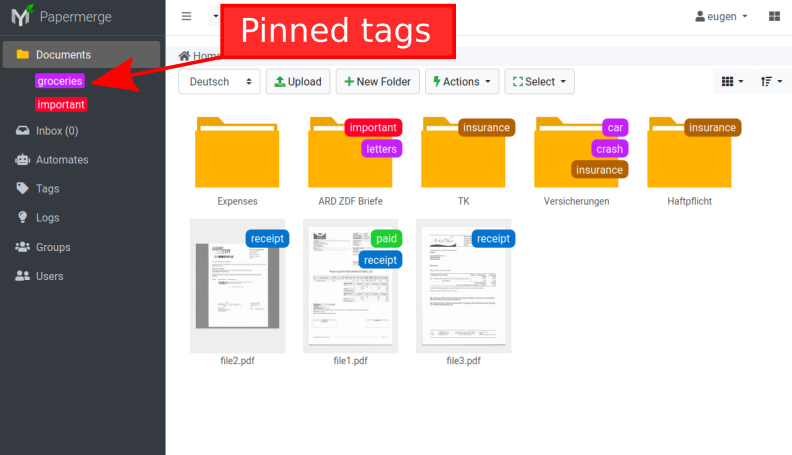
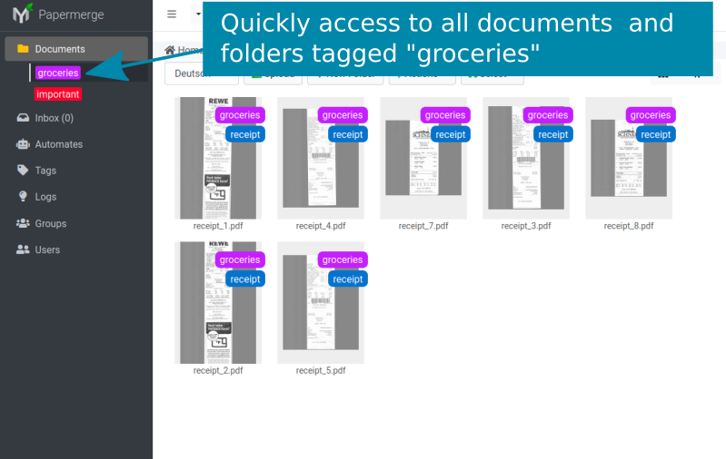
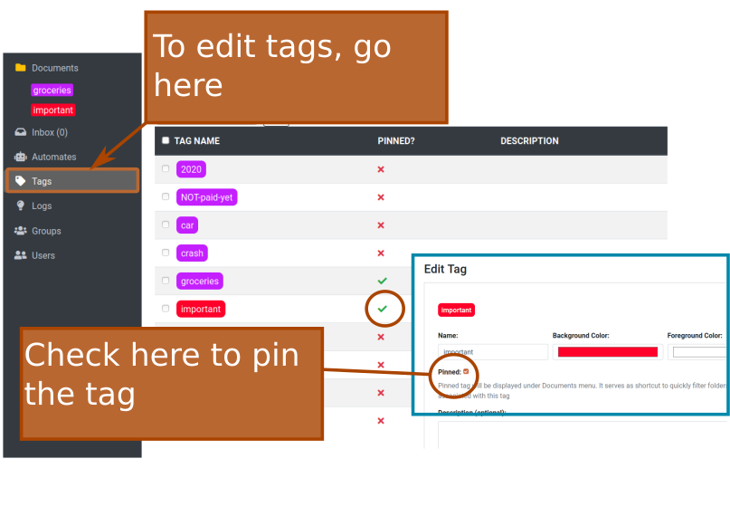
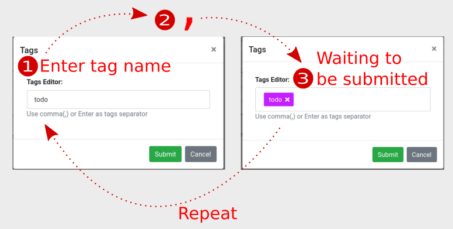

Tags
============

`Watch here an youtube screencast <https://www.youtube.com/watch?v=bshUowL57t8>`_ showing tags in action.

Organizing your documents in folders may serve you well for the beginning. However as
number of folders grow it starts to be very challenging to keep organized. 

Folders have one huge disadvantage: it is very
easy to forget which document belongs to which folder.

Tags comes to the rescue. For example if you have car insurance document just
assign to it a series of tags: "car, insurance, crash" and then, even if you
forgot where you placed your insurance documents just search for documents
with "insurance" and/or "car" tags.

Main Concepts
~~~~~~~~~~~~~~

Tags are kind of labels. You can associate (add) tags to a document or to a
folder. Tags have a color and a name.
Once tagged, documents can be searched by their tags. Conversely, is it also
possible to show all the documents tagged with a particular tag(s).

Tags can be **pinned on the left bar** for quick access. It is easier to explain pinning with help of images:

In order to pin a tag, you need check "Pinned" checkbox. You can do that in
edit form of respective tag. Also, in edit form of the tag, you can change
tag's color (foreground and background). *Foreground color* is color of the text
which is written on the tag.

Remember the Comma (,)
~~~~~~~~~~~~~~~~~~~~~~

Comma, that is the "," character is used as tags separator. So whenever you
add tags (even if you are adding only one) - you need to **press comma at the
end of each tag name**; if you forget to do that - whatever text you entered
will be discarded and tag will not be created.

