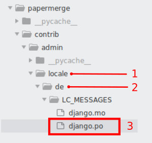

.. _translate:

Translations
=============

Translations files have ``.po`` extentions. There two .po translation files. One located in papermerge.contrib.admin app
and another one in papermerge.core app.

	German translations for papermerge.contrib.admin app

1. Locale folder
2. Locale language code (de - Deutsch - German)
3. The ``.po`` translation file itself.

Note that LC_MESSAGES folder must be there verbatim.
You don't need to create .po files manually!
There is a django command for that. Thus, in case you want to translate
Papermerge to French (by the way, thanks for your contribution!), you need to::

	./manage.py makemessages -l fr

Above command will create fr/LC_MESSAGES/django.po files in both apps -
papermerge.contrib.admin and papermerge.core.

Open .po file in your favorite text editor and translate as many strings you
want (again, thank you!).

When your translation mood is depleted (i.e. you're done with translations), run::

   ./manage.py compilemessages -l fr

And you are ready to commit and create a Pull Request.
